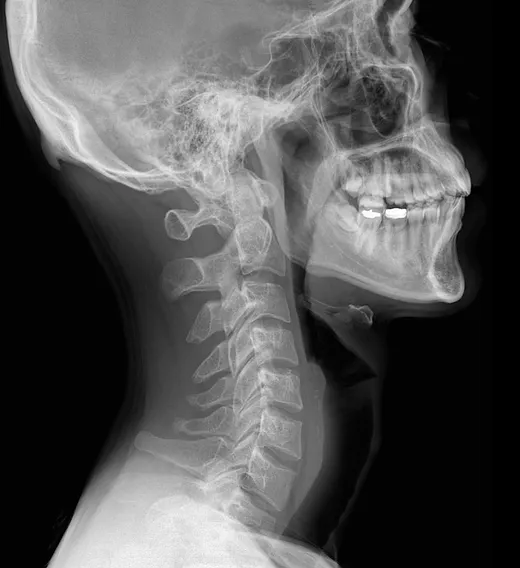

# X-ray Image Processing with CLAHE

This repository contains a Jupyter notebook that processes a directory of X-ray images using Contrast Limited Adaptive Histogram Equalization and saves images to a new directory. This processing is part of a larger project aimed at training an image detection program to detect anomalies in X-ray images.

## Requirements

- OpenCV
- NumPy
- Matplotlib

## Installation

1. Clone the repository:
    ```sh
    git clone https://github.com/yourusername/xray-clahe.git
    cd xray-clahe
    ```

2. Install the required packages:
    ```sh
    pip install opencv-python numpy matplotlib
    ```

## Usage

1. Place your X-ray images (JPG format) in a directory.

2. Adjust and run the Jupyter notebook:

3. The notebook will process the images using CLAHE and save the images in a new directory you can label in the notebook.

## Notebook Overview

The notebook performs the following steps:

2. Defines the CLAHE functions.
3. Processes each image in the input directory and applies CLAHE.
4. Saves the processed images to the output directory.

## Example

Here is an example of how the processed images will look:

**Before:**



**After:**


## License

This project is licensed under the MIT License - see the [LICENSE](LICENSE) file for details.

## Acknowledgments

This project is part of a larger effort to improve image detection for medical imaging, specifically for detecting anomalies in X-ray images.
